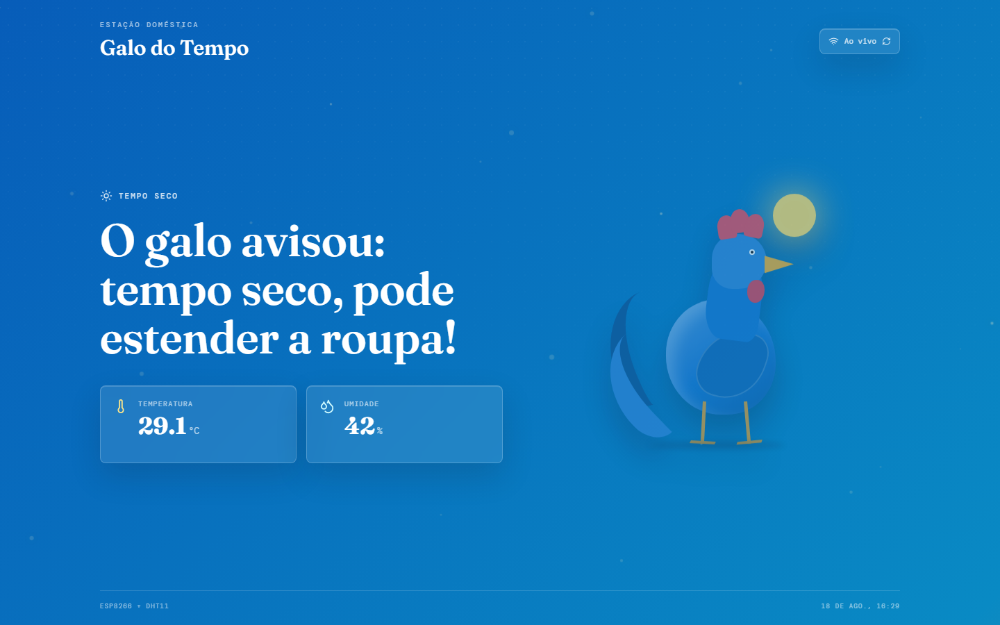
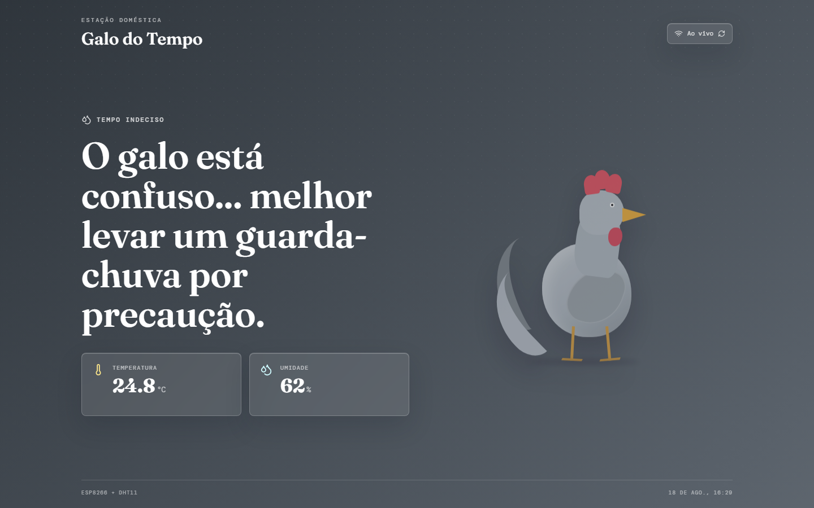
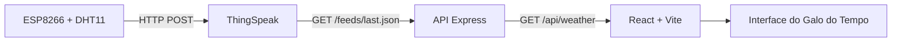

# 🐓 Galo do Tempo

Painel climático em tempo real inspirado no clássico "galo do tempo" luso-brasileiro, que muda de cor conforme a umidade do ar. O projeto conecta um **ESP8266 + DHT11** à nuvem via **ThingSpeak** e exibe as leituras em uma interface web nostálgica, animada e responsiva.

| Seco | Transição | Chuvoso |
| :---: | :---: | :---: |
|  |  |  |

## ✨ Funcionalidades

- **Leitura em tempo real**: consulta a última medição do canal ThingSpeak através de uma API própria.
- **3 estados climáticos** definidos pela faixa de umidade, cada um com gradiente, partículas e frase de humor exclusivos:
  | Estado | Umidade | Visual | Frase |
  | --- | --- | --- | --- |
  | 🌞 Seco | < 50% | Gradiente azul, partículas de brilho | "O galo avisou: tempo seco, pode estender a roupa!" |
  | 🌫️ Transição | 50% – 70% | Gradiente cinza/chumbo, névoa sutil | "O galo está confuso... melhor levar um guarda-chuva por precaução." |
  | 🌧️ Chuvoso | > 70% | Gradiente rosa/roxo, chuva animada | "Corre que o galo ficou roxo: recolha os tapetes e a roupa do varal!" |
- **Polling inteligente**: busca novos dados a cada 15 segundos, pausando automaticamente quando a aba está em segundo plano.
- **Resiliência a falhas**: mantém a última leitura válida em tela e sinaliza o status da conexão caso o sensor ou o ThingSpeak fiquem indisponíveis.
- **Glassmorphism + Framer Motion**: cartões de temperatura/umidade com efeito de vidro e animações fluidas de fundo, partículas e transição de estado.
- **Acessibilidade**: respeita `prefers-reduced-motion`, alternando para uma versão estática das transições quando o usuário preferir menos animação.

## 🏗️ Arquitetura



Monorepo organizado como **npm workspaces**:

```
├── client/          # Frontend React + TypeScript + Vite
│   └── src/
│       ├── components/   # WeatherParticles, WeatherRooster
│       ├── hooks/         # useWeather (polling + estado)
│       ├── App.tsx
│       └── types.ts
├── server/          # Backend Node.js + TypeScript + Express
│   └── src/
│       ├── index.ts       # Servidor Express e rotas
│       └── weather.ts     # Integração com ThingSpeak e regras de negócio
└── docs/screenshots/
```

## 🧰 Stack

**Backend:** Node.js, TypeScript, Express 5, Axios, Helmet, CORS, dotenv.
**Frontend:** React 19, TypeScript, Vite, Tailwind CSS 4, Framer Motion, Lucide React.
**Fonte de dados:** [ThingSpeak API](https://thingspeak.com/) (`GET /channels/:id/feeds/last.json`).

## ✅ Pré-requisitos

- Node.js `>= 20.19.0`
- Um canal ThingSpeak recebendo temperatura em `field1` e umidade em `field2` (ex.: ESP8266 + DHT11)

## 🚀 Configuração e desenvolvimento

1. Instale as dependências (raiz + workspaces `client` e `server`):
   ```bash
   npm install
   ```
2. Copie `.env.example` para `.env` na raiz do projeto:
   ```bash
   cp .env.example .env
   ```
3. Preencha as variáveis de ambiente:

   | Variável | Obrigatória | Descrição |
   | --- | --- | --- |
   | `THINGSPEAK_CHANNEL_ID` | Sim | ID do canal ThingSpeak do dispositivo |
   | `THINGSPEAK_READ_API_KEY` | Apenas para canais privados | Read API Key do canal |
   | `PORT` | Não (padrão `3001`) | Porta da API Express |
   | `CLIENT_ORIGIN` | Não (padrão `http://localhost:5173`) | Origem permitida pelo CORS |

4. Suba backend e frontend simultaneamente:
   ```bash
   npm run dev
   ```
5. Abra [http://localhost:5173](http://localhost:5173).

A interface consulta a API local a cada 15 segundos e mantém a última leitura válida em caso de falhas temporárias.

## 📡 API

| Método | Rota | Descrição |
| --- | --- | --- |
| `GET` | `/health` | Verifica se a API está no ar (`{ status: "ok" }`) |
| `GET` | `/api/weather` | Retorna a leitura mais recente do ThingSpeak já classificada |

Resposta de `/api/weather`:

```json
{
  "temperature": 24.5,
  "humidity": 62,
  "state": "transition",
  "observedAt": "2026-08-18T12:00:00Z",
  "fetchedAt": "2026-08-18T12:00:03Z"
}
```

Erros são retornados com o status apropriado (`503` sem configuração/dados do sensor, `502` ThingSpeak indisponível, `500` erro inesperado).

## 📦 Produção

```bash
npm run build
npm start
```

- `npm run build` compila o `server` e gera o bundle estático do `client` (`client/dist`).
- Sirva `client/dist` em um host estático (Vercel, Netlify, Nginx, etc.) e execute a API com `npm start`.
- Encaminhe as chamadas de `/api` para a API Express ou defina `VITE_API_URL` no build do frontend apontando para a URL pública da API.

## ▲ Deploy único na Vercel

O projeto também pode ser hospedado inteiramente na Vercel: o frontend vira o build estático e a pasta `api/` (na raiz) é publicada como Serverless Functions no mesmo domínio, reaproveitando a lógica de `server/src/weather.ts` — sem precisar de CORS nem de um host separado para a API.

1. Importe o repositório na Vercel mantendo o **Root Directory** como a raiz do projeto (não `client`).
2. A Vercel usa automaticamente as configurações de [vercel.json](vercel.json) (`buildCommand`, `outputDirectory`) e detecta a pasta `api/` como funções serverless.
3. Configure as variáveis de ambiente do projeto na Vercel: `THINGSPEAK_CHANNEL_ID` e, se necessário, `THINGSPEAK_READ_API_KEY`.
4. Deploy. O frontend passa a chamar `/api/weather` e `/api/health` no mesmo domínio automaticamente (não é preciso definir `VITE_API_URL`).

O `server/` (Express) continua existindo para o desenvolvimento local via `npm run dev`.

## 🧪 Qualidade

```bash
npm run lint
```

Executa a checagem de tipos (`tsc --noEmit`) no `server` e o ESLint no `client`.

---

### Autor

Desenvolvido por **Kauã Aissa**


- **GitHub:** [KauaAissa](https://github.com/KauaAissa)
- **LinkedIn:** [kauaaissa](https://www.linkedin.com/in/kauaaissa/)
- **E-mail:** kaua.aissa.dev@gmail.com

---